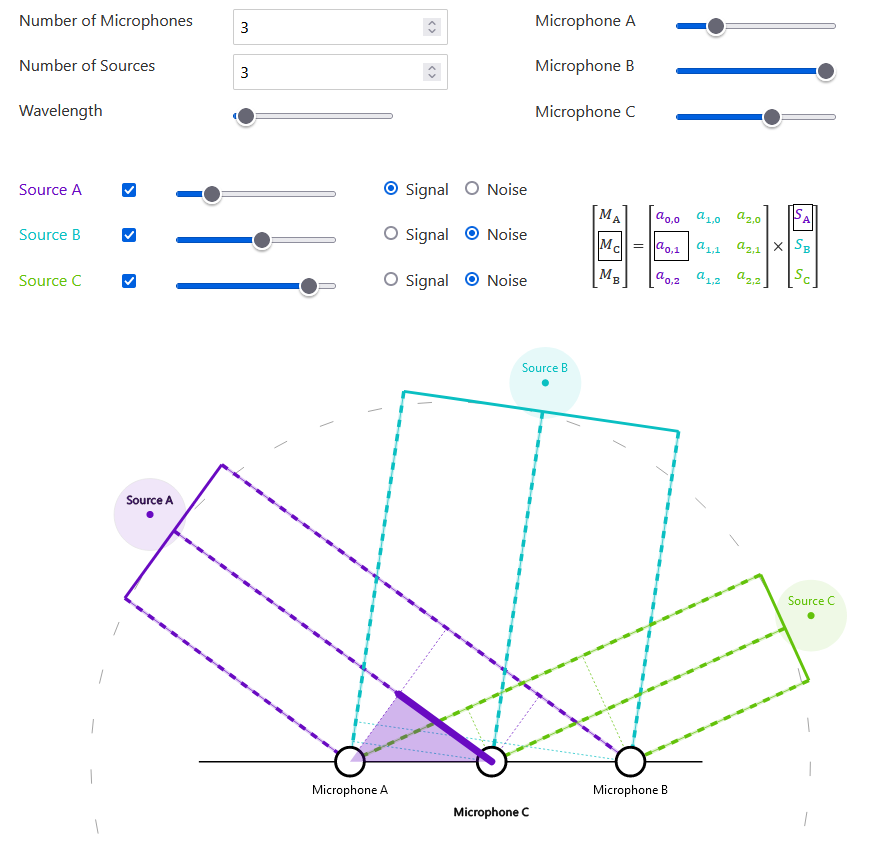

[Live Demo](https://static.laszlokorte.de/beamformer/)

# Beam Former

Below you can explore recording multiple sound sources with multiple microphones results yields a linear transformation in the spectral domain. If there are at least as many microphones as sound sources the linear transformation can be inverted to recover the individual source signals. A common case is to select one source as desired signal and assume the other sources as noise. Then one can reduce the noise by reverting the transformation and then selecting the clean source.